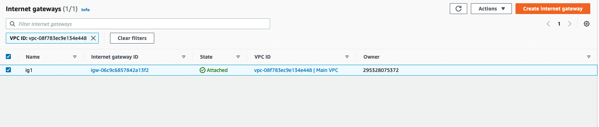
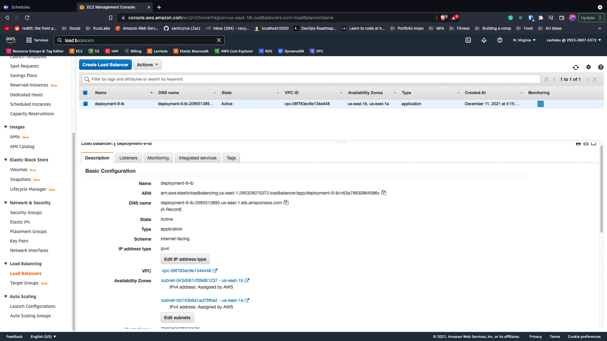

<h1 align=center>VPC Deployment through Terraform</h1>

## Purpose 

The purpose of this deployment/repo was to create a VPC consisting of an EC2, RDS postgres database, and an application load balancer. 
The flow of data would be user -> internet -> load-balancer -> EC2 -> RDS database. 

## Thought Process

I structured the project into files and designated the resources they affect. Such as the vpc.tf file pertaining to the VPC and it's underlying features, and ec2.tf featuring the security groups and ec2 instance.

### Creating the VPC

Utilized the terraform resource block "aws_vpc" to create a vpc named "Main VPC" with a cidr block of 10.0.0.0/18. 

I then created all the subnets required utilizing a variation of following code block. Changing the availability_zone tag for when I need a subnet in a different AZ as well as changing the cidr block since subnets can't share the same cidr block. 
```
resource "aws_subnet" "public01" {
  vpc_id            = aws_vpc.main.id
  cidr_block        = "10.0.1.0/24"
  availability_zone = "us-east-1a"
  tags = {
    Name = "Public01"
  }
}
```

Next I created an internet gateway in order to allow the VPC to access the internet. 

Then added a nat gateway resource so the private subnets would be able to access services outside the VPC. 

Lastly configured a route table and the appropriate routes for the subnets to configure network traffic. 





### Creating the EC2

Created an EC2 using the terraform aws_instance resource block. Looked up the ami for an Ubuntu image in us east 1, and configured the instance to be a t2.micro (to keep it in the free tier). Lastly placed it in the private subnet that was created in the vpc.tf file.


#### Error

I ran into an error here while setting up the security groups for the EC2 and the load balancer at the same time. The error was a cycle error in which the security groups were dependent on each other to be created. To circumvent this I used the aws_security_group resource to create the security group, while using the aws_security_group_rule to set the individual ingress and egress rules. 

Also ran into a naming convention error. Can't name security groups starting with sg-*****


```
resource "aws_security_group" "ubuntu_ec2" {
  name        = "ubuntu-deploy09-sg"
  description = "Ubuntu security group for terraform"
  vpc_id = aws_vpc.main.id

}

resource "aws_security_group_rule" "accept_traffic_from_lb" {
  type = "ingress"
  from_port   = 80
  to_port     = 80
  protocol    = "tcp"
  security_group_id = aws_security_group.ubuntu_ec2.id
  source_security_group_id = aws_security_group.alb-sg.id
  
}

resource "aws_security_group_rule" "outbound_rule_4_ec2" {
  type = "egress"
  from_port   = 0
  to_port     = 0
  protocol    = "tcp"
  security_group_id = aws_security_group.ubuntu_ec2.id
  cidr_blocks     = [aws_vpc.main.cidr_block]
  
}
```

### Creating the Load Balancer

To create the LB I utilized the aws_lb resource from Terraform, configured with the security group defined within the same file to accept all port 80 inbound traffic and allow only port 80 outbound traffic to our EC2 security group, and the appropriate subnets defined within the vpc.tf file.

After defining the LB I created the target group which consisted of the EC2 created earlier to attach it to the load balancer.




### Creating the database

Created the database using the aws_db_instance resource from Terraform, by doing this I was able to configure the database to be multi-az, have a custom username and password, and set the instance class. I also created a db subnet group consisting of the two internal subnets created in the vpc.tf file. 

